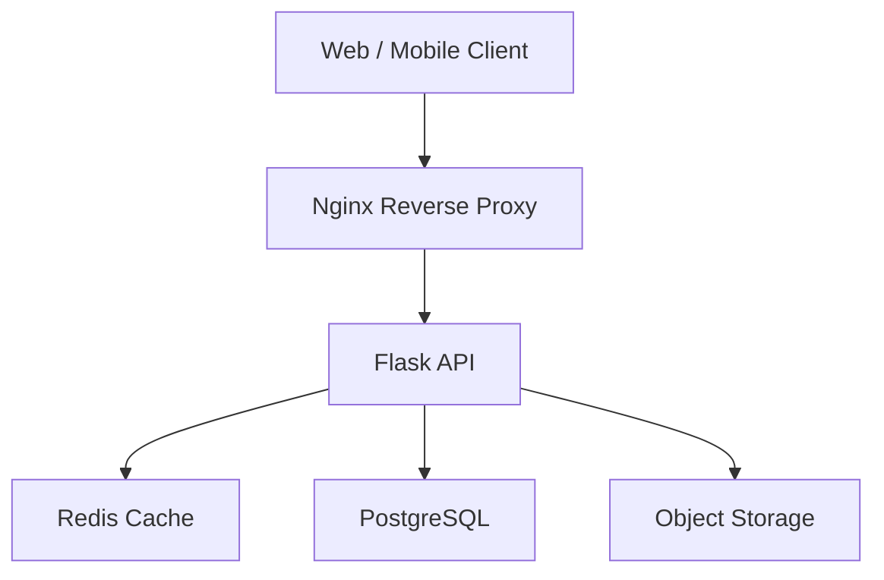

# System Architecture

```mermaid
flowchart TD
    Client[Web / Mobile Client] --> Nginx[Nginx Reverse Proxy]
    Nginx --> Flask[Flask API]
    Flask --> Redis[Redis Cache]
    Flask --> Mysql[PostgreSQL]
    Flask --> Storage[Object Storage]
```

The deployment is designed for scaling across multiple instances behind Nginx with Redis and PostgreSQL for state and caching.
